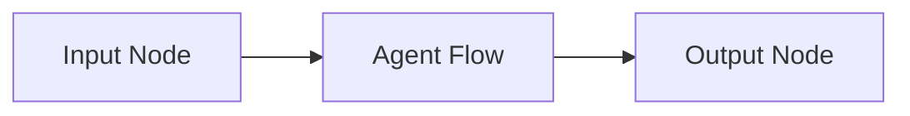

# DESIGN.md

## System Design — Pocket Flow Agent Harness

This document defines the high-level architecture, flow design, and core abstractions for the self-extensible agent system described in `PLAN.md`.

---

## 1. Design Philosophy

This system follows **Pocket Flow principles**:

- Graph-based execution (Nodes + Flows)
- Shared state as the single source of truth
- Clear separation of:
  - Data (`shared`)
  - Logic (Nodes)
  - Orchestration (Flows)

### Core Ideas

- **Agents = decision-making flows**
- **Skills = reusable nodes or sub-flows**
- **System evolves via composition, not mutation**

---

## 2. System Overview

The system consists of four main layers:

```
[TUI Layer]
    ↓
[Harness Flow]
    ↓
[Agent Flow]
    ↓
[Skill Execution Layer]
```

---

## 3. Core Components

### 3.1 TUI Layer

Responsibilities:
- Accept user input (task)
- Trigger flow execution
- Display:
  - Current node
  - Shared state
  - Execution trace

Initial version:
- Simple CLI loop (stdin/stdout)
- No advanced rendering required

---

### 3.2 Harness Flow

The top-level orchestration flow.

#### Responsibilities:
- Initialize shared state
- Inject task input
- Start agent execution
- Return final output

#### Flow Structure



---

### 3.3 Agent Flow (Core Logic)

Implements the **decision loop**.

#### Responsibilities:
- Maintain context
- Decide next action (skill)
- Execute skill
- Optionally reflect and iterate

#### Flow Structure

```mermaid
flowchart LR
    context[Context Node] --> decide[Decision Node]
    decide -->|skill| execute[Execution Node]
    execute --> reflect[Reflection Node]
    reflect -->|continue| decide
    reflect -->|exit| end[End]
```

---

## 4. Shared Store Design

The shared store is a global in-memory dictionary.

```python
shared = {
  "task": str,
  "context": list,
  "skills": dict,
  "agents": dict,
  "history": list,
  "state": dict,
  "current_action": str,
  "last_result": any
}
```

### Key Principles

- **Single source of truth**
- No hidden state inside nodes
- Use references instead of copying data
- Append-only history where possible

### Data Responsibilities

| Key              | Purpose |
|------------------|--------|
| `task`           | User input |
| `context`        | Accumulated working context |
| `skills`         | Registry of available skills |
| `agents`         | Optional multi-agent registry |
| `history`        | Execution trace |
| `state`          | Arbitrary working memory |
| `current_action` | Selected skill |
| `last_result`    | Output of last execution |

---

## 5. Node Design

Each node follows the Pocket Flow lifecycle:

```
prep → exec → post
```

---

### 5.1 Context Node

**Purpose:** Prepare relevant context for decision-making

- `prep`: read task, history, state
- `exec`: optionally summarize/filter
- `post`: write updated context

---

### 5.2 Decision Node (Agent Brain)

**Purpose:** Select next action (skill)

- Input:
  - task
  - context
  - available skills

- Output:
  - `action` (skill name)
  - optional parameters

#### Behavior

- Uses LLM (or rule-based logic)
- Must choose from explicit action space
- Writes to:
  - `shared["current_action"]`

---

### 5.3 Execution Node

**Purpose:** Execute selected skill

- `prep`: read `current_action`
- `exec`: run corresponding skill (node or flow)
- `post`: store result in `last_result`, update history

---

### 5.4 Reflection Node

**Purpose:** Evaluate progress and control loop

- `prep`: read last result + context
- `exec`: decide:
  - continue
  - retry
  - exit
- `post`: return action (`continue` or `exit`)

---

## 6. Skill System Design

### Definition

A **Skill** is:
- A Node OR
- A Flow (composed of nodes)

---

### Skill Registry

Stored in:

```python
shared["skills"] = {
  "skill_name": skill_object
}
```

---

### Skill Requirements

- Must follow Node/Flow interface
- Must be callable from Execution Node
- Must be reusable and composable

---

### Example Skill Types

- LLM completion
- Text transformation
- File read/write
- Web search
- Sub-agent flow

---

## 7. Self-Extension Mechanism

### Goal

Allow agents to create new capabilities dynamically.

---

### Process

1. Agent decides to create a new skill
2. Generates:
   - Node or Flow definition
3. Registers it:

```python
shared["skills"][new_skill_name] = new_skill
```

4. Skill becomes available in future decisions

---

### Constraints

- Must follow system interfaces
- Must be inspectable (no hidden logic)
- Prefer composition of existing skills

---

## 8. Flow Composition Strategy

### Principles

- Keep flows shallow initially
- Use sub-flows for reusable logic
- Avoid deeply nested graphs early

---

### Expansion Path

1. Single agent loop
2. Add reflection
3. Add skill generation
4. Add sub-flows
5. (Optional) multi-agent coordination

---

## 9. Logging & Observability

### Required

- Node execution logs
- Action transitions
- Shared state snapshots (optional)

---

### Stored in:

```python
shared["history"] = [
  {
    "node": str,
    "action": str,
    "result": any
  }
]
```

---

## 10. Minimal Viable System

### Must Include

- CLI input/output
- One working agent loop
- 2–3 skills
- Decision + execution cycle

---

### Must NOT Include (Initially)

- Multi-agent orchestration
- Complex persistence
- Advanced UI frameworks

---

## 11. Future Extensions

- Persistent skill storage
- Visual flow graph rendering
- Parallel/async execution
- Multi-agent systems
- RAG integration
- External tool APIs

---

## 12. Summary

This system is:

- **Composable**: built from nodes and flows
- **Inspectable**: all state is visible
- **Extensible**: new skills emerge dynamically
- **Minimal-first**: complexity added through iteration

The architecture ensures that intelligence emerges from:
> structured decision-making over reusable capabilities

—not hardcoded logic.
