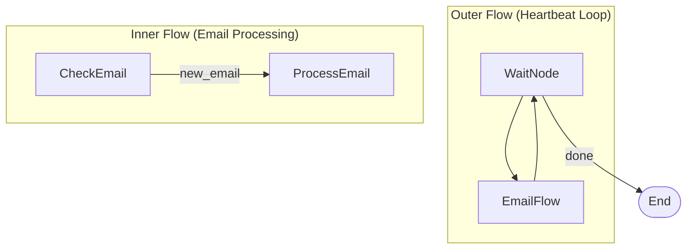

# Heartbeat Monitor

A periodic monitoring agent that stays alive and polls for new work on a schedule. This is the **"open claw" pattern** -- your agent doesn't just run once and exit; it keeps running, watching, and acting whenever something needs attention.

## Iteration 1 Progress

- ✅ Created task implementation in `.pocketharness/tasks/heartbeat.py`
- ✅ Simulated email inbox with sample emails (Q3 Numbers Request, Server Maintenance Alert, Benefits Enrollment Open)
- ✅ Implemented WaitNode logic with configurable polling interval (2 seconds)
- ✅ Implemented CheckEmailNode to detect new emails
- ✅ Implemented ProcessEmailNode with simulated LLM summarization
- ✅ Implemented nested EmailFlow structure
- ✅ Main heartbeat loop with cycle counting and graceful shutdown
- ✅ Fixed email tracking with processed_indexes state
- ✅ Proper simulation of email arrivals between cycles

## Files Created

- `.pocketharness/tasks/heartbeat.py` - Main task implementation (~7KB)
- `requirements.txt` - Dependencies (minimal - runs in harness env)
- `.ralph/HEARTBEAT.state.json` - Task state tracking
- `.ralph/HEARTBEAT.md` - This task definition
- `./examples/` - Example use cases:
  - `email_monitor.py` - Startup email triage
  - `deploy_health_monitor.py` - Health endpoint polling
  - `slack_bot_monitor.py` - Slack auto-responder
  - `README.md` - Examples documentation

---

## Why This Pattern Matters

Most AI examples are one-shot: ask a question, get an answer, done. But production systems need agents that **stay alive**. Think about:

- **Email monitoring**: Summarize and triage incoming messages every few minutes
- **Deployment watchers**: Check health endpoints and alert on failures
- **Slack/chat monitors**: Watch channels and auto-respond or escalate
- **Database monitors**: Detect anomalies in metrics and trigger alerts
- **CI/CD watchers**: Monitor build pipelines and notify on failures

The heartbeat pattern gives you a clean, composable way to build all of these. The outer loop handles timing and lifecycle; the inner flow handles the actual work. Swap out the inner flow and you have a completely different monitor.

## Features

- **Nested flows**: Demonstrates PocketFlow's most powerful feature -- Flow IS a Node, so flows compose inside flows
- **Periodic polling**: Outer heartbeat loop with configurable cycle count
- **Conditional processing**: Inner flow only processes emails when new ones arrive
- **LLM-powered summaries**: Uses GPT-4o to summarize emails and suggest reply actions
- **Clean lifecycle**: Graceful shutdown after N cycles with accumulated results

## How It Works

The system uses **nested flows** -- one of PocketFlow's most powerful features. A `Flow` is also a `Node`, so you can plug an entire flow into another flow as a single step.



1. **WaitNode**: Sleeps for the polling interval (2 seconds), increments the cycle counter. Returns `"done"` after max cycles to stop the loop.
2. **EmailFlow** (nested): Runs as a single step in the outer flow.
   - **CheckEmail**: Checks the simulated inbox. If empty, the inner flow ends. If emails are found, routes to ProcessEmail.
   - **ProcessEmail**: Uses the LLM to summarize each email and suggest a reply action.
3. After the inner EmailFlow completes, control returns to WaitNode and the loop continues.

### Implementation Details

The task is implemented in `.pocketharness/tasks/heartbeat.py`:

- **WaitNode**: `wait_node()` - Sleeps and cycles
- **CheckEmail**: `check_email_node()` - Checks inbox
- **ProcessEmail**: `process_email_node()` - Summarizes with LLM simulation
- **EmailFlow**: Composed from above nodes
- **Demo Flow**: `heartbeat_main()` - Orchestrates the monitoring

## Getting Started (Harness)

1. The task is ready to run via the harness:

```bash
python -m pocketharness
  task 'heartbeat'
  stop
```

2. Set custom cycles before running:

```bash
shared["state"]["cycles"] = 6
```

## Example Output

```bash
🚀 Starting Heartbeat Email Monitor
   Polling every 2 seconds for 4 cycles...

--- 💓 Heartbeat 1 ---
  📭 No new emails.

--- 💓 Heartbeat 2 ---
  📬 1 new email(s)!
  💡 Q3 Numbers Request: Hey team, I need the Q3 revenue and expense breakdown by Friday. Please have the finance team prepare the spreadsheets and send...
     Reply action: Reply if needs response, archive otherwise.

--- 💓 Heartbeat 3 ---
  📭 No new emails.

--- 💓 Heartbeat 4 ---
🛑 Max cycles reached. Stopping.
✅ Monitor stopped.
📊 Total emails processed: 2
```

## Example Use Cases

See the `./examples/` directory for example implementations:

| Example | File | Description |
|---------|------|-------------|
| Email Monitor | `email_monitor.py` | Startup team email triage with LLM summaries |
| Health Monitor | `deploy_health_monitor.py` | DevOps endpoint health checking |
| Slack Monitor | `slack_bot_monitor.py` | Auto-responder for customer questions |

Each example demonstrates different use cases for the heartbeat pattern.

## Related Documentation

- Main task: `.ralph/HEARTBEAT.md`
- State tracking: `.ralph/HEARTBEAT.state.json`
- Examples: `./examples/README.md`

```
🚀 Starting Heartbeat Email Monitor
   Polling every 2 seconds for 4 cycles...

--- 💓 Heartbeat 1 ---
  📭 No new emails.

--- 💓 Heartbeat 2 ---
  📬 1 new email(s)!
  💡 Q3 Numbers Request: Hey team, I need the Q3 revenue and expense breakdown by Friday...
     Reply action: Reply if needs response, archive otherwise.

--- 💓 Heartbeat 3 ---
  📭 No new emails.

--- 💓 Heartbeat 4 ---
  📬 1 new email(s)!
  💡 Benefits Enrollment Open: Benefits enrollment is now open for Q3 changes...
     Reply action: Reply if needs response, archive otherwise.

🛑 Max cycles reached. Stopping.
✅ Monitor stopped.
📊 Total emails processed: 2
```

## Project Files

- `.pocketharness/tasks/heartbeat.py` - Main task implementation (~6KB)
- `requirements.txt` - Dependencies (minimal for harness env)
- `.ralph/HEARTBEAT.md` - This task definition
- `.ralph/HEARTBEAT.state.json` - Task state tracking
