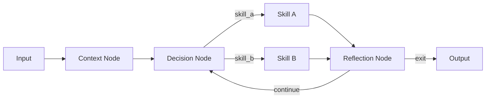

# PLAN.md

## Agentic-Coding Optimized — Execution Plan

Design and implement a minimal, extensible agent system using Pocket Flow, strictly following agentic coding principles and iterative development.

---

## 1. Requirements (Start Simple)

Build a terminal-based (TUI) agent harness that:
- Executes Pocket Flow graphs (Nodes + Flows)
- Allows inspection of execution state (shared store, current node, transitions)
- Supports running, debugging, and re-running flows

⚠️ Do NOT over-engineer. Start with a minimal working system.

---

## 2. High-Level Flow Design (Before Coding)

Define the system architecture using flows:

### Core Harness Flow
```
Input → Agent Execution → Output
```

### Agent Flow (Decision Loop)
```
Context Node → Decision Node → Action (Skill) Node → Loop or Exit
```

### Skill System
- Skills are reusable Nodes or sub-Flows
- Skills must be composable and parameterizable

### Example Diagram


---

## 3. Shared Store Design (Critical)

Define a clear shared state schema:

```python
shared = {
  "task": str,
  "context": list,
  "skills": dict,
  "agents": dict,
  "history": list,
  "state": dict
}
```

Guidelines:
- All nodes MUST read/write via shared store
- Avoid duplication; use references
- Keep schema simple and extensible

---

## 4. Node & Skill Design

### Core Node Types

#### Decision Node (Agent Brain)
- Chooses next action (skill) based on context

#### Skill Nodes
- Encapsulate capabilities (LLM calls, tools, transformations)

#### Execution Node
- Runs selected skill and updates shared state

#### Reflection Node (Optional but Recommended)
- Evaluates results and decides whether to continue or retry

---

### Node Structure

Each node must define:

- `prep(shared)`
  - Reads required data from shared store

- `exec(prep_res)`
  - Performs computation (LLM/tool/etc.)

- `post(shared, prep_res, exec_res)`
  - Writes results + returns next action

---

## 5. Implementation (Keep It Minimal)

Build in this order:

1. Minimal TUI (CLI loop is enough)
2. Basic Flow execution harness
3. One simple agent with:
   - 2–3 skills
   - Decision loop
4. Logging + debug visibility

### Avoid:
- Complex abstractions
- Premature multi-agent systems
- Over-generalization

---

## 6. Self-Extension Mechanism (Core Goal)

Enable agents to extend the system:

- Generate new skills (Nodes or Flows)
- Register them into `shared["skills"]`
- Reuse them in future runs

### Constraints:
- Must follow Pocket Flow structure
- Must be inspectable and debuggable
- Prefer composition over mutation

---

## 7. Iteration & Improvement

After initial version:

- Improve decision-making prompts
- Add better context management
- Introduce reflection/self-evaluation
- Expand skill library gradually

---

## 8. Output Requirements

### Project Structure

```
/project
  main.py
  flow.py
  nodes/
  skills/
  tui/
  docs/design.md
```

### Deliverables

- Working minimal prototype
- Clear separation of concerns:
  - Flow logic
  - Node definitions
  - Utilities

---

## Guiding Principles

- Start simple → iterate fast
- Flows define behavior, not hardcoded logic
- Shared store is the source of truth
- Skills = reusable building blocks
- Agents = decision-making over skills

---

## Goal

A self-extensible, inspectable agent system where new capabilities emerge through composition of Pocket Flow nodes and flows—not hardcoded logic.
